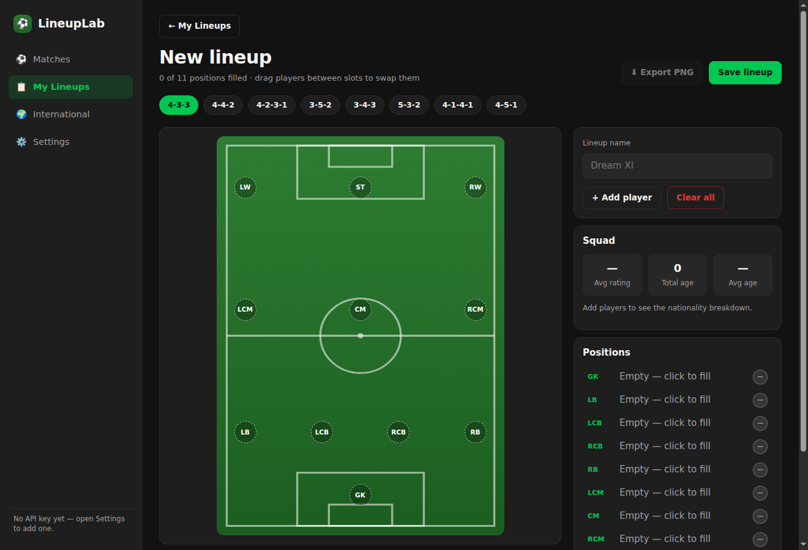

# LineupLab for Windows

The desktop version of LineupLab: browse real football matches, read confirmed lineups
with per-player match ratings, nationalities and ages, and build custom XIs from any
player in the API-Football database.

It installs like any other Windows program and leaves an icon on your desktop.



---

## 1. Build the app you can double-click

You need [Node.js 20 or newer](https://nodejs.org) on a Windows PC. Then:

```powershell
git clone https://github.com/scare-1234/Lineups.git
cd Lineups\desktop
npm install
npm run dist:win
```

That writes two things to `desktop\release\`:

| File | What it is |
| --- | --- |
| `LineupLab-Setup-1.0.0.exe` | Normal installer. Run it, click through, and you get a **desktop icon** plus a Start-menu entry. Uninstalls from Settings like anything else. |
| `LineupLab-1.0.0-portable.exe` | A single file that just runs — no installation. Drop it on your desktop if you would rather not install anything. |

Prefer not to install at all? `npm run dist:dir` produces `desktop\release\win-unpacked\`,
a plain folder containing `LineupLab.exe`. Right-click it → *Send to* → *Desktop (create
shortcut)*.

> The installer step (NSIS) has to run on Windows. The app itself cross-compiles anywhere,
> which is how this project is tested on Linux CI.

### First run

The app opens on **Settings** and asks for an API-Football key:

1. Create a free account at <https://dashboard.api-football.com/register> (100 requests a day).
2. Copy the key from the dashboard.
3. Paste it into Settings and press Save.

The key is written to `%APPDATA%\lineuplab-desktop\config.json` — your own machine only. It
is never stored in the project, never committed, and never handed to the part of the app
that renders the UI. Setting an `API_FOOTBALL_KEY` environment variable overrides the file,
which is handy for scripted runs.

Everything that does not need live data — the lineup builder, saved XIs, formations — works
before you add a key.

---

## 2. What the app does

- **Matches** — a date strip covering the last and next seven days, league filter chips
  (Premier League, La Liga, Serie A, Bundesliga, Ligue 1, Champions League, World Cup,
  International), fixtures grouped by competition, live matches with a pulsing badge.
- **Match detail** — Lineups (both teams on one pitch, positioned from the API's own grid
  coordinates, with colour-coded rating badges), Stats, Events and Info.
- **Player detail** — nationality flag, age, position, club, height and weight, the latest
  match rating, season statistics and the per-match numbers.
- **Lineup builder** — eight formations, click any slot to search the whole player
  database, filter by position, nationality and rating, Quick Fill, drag and drop to swap
  players, and a live squad summary (average rating, total age, nationality breakdown).
  Change formation at any time: players move to the nearest compatible slot and anyone who
  no longer fits waits in an "unplaced" row rather than disappearing.
- **My Lineups** — saved XIs with mini-pitch previews, duplicate, delete, and **Export PNG**
  to save a shareable picture of your lineup.
- **International** — World Cup, Euro, Copa América, AFCON, Asian Cup, Nations League,
  qualifiers and friendlies, plus national squads by country.

---

## 3. Development

```powershell
npm run dev        # Vite dev server + Electron with hot reload
npm run build      # compile main, preload and renderer into dist/
npm start          # build, then run the app
npm test           # unit tests (vitest)
npm run typecheck  # TypeScript across main, renderer and tests
npm run smoke      # launch the built app and screenshot every screen
```

`npm run smoke` drives the real app over the Chrome DevTools Protocol, walks through every
screen and writes PNGs to `release/smoke/`. On Linux CI, run it as
`xvfb-run -a npm run smoke`. It fails if a screen cannot be reached, so a broken render is
caught without a human looking.

### Layout

```
desktop/
├── src/main/        Electron main process: config, disk cache, API client, IPC
├── src/preload/     the single contextBridge surface (bundled, sandbox-safe)
├── src/renderer/    React UI: screens, components, styles
├── src/shared/      types, formation engine, flags, rating scale, validation, mapping
├── scripts/         headless smoke test
└── build/           app icon
```

### Security posture

- `contextIsolation: true`, `sandbox: true`, `nodeIntegration: false`.
- The renderer makes **no** network calls and touches **no** files. Every request goes
  through a typed IPC surface, so the API key never leaves the main process.
- Navigation away from the app is blocked and external links open in the system browser.
- A Content-Security-Policy limits the page to its own assets plus API-Football's image CDN.

### How it stays inside 100 requests a day

- Live data (fixtures, lineups, in-match stats) is reused for 5 minutes; player profiles,
  leagues and standings for 24 hours. A fresh cache hit never touches the network.
- 429 responses are retried with exponential backoff, then fall back to cached data behind
  a "Daily limit reached" banner.
- Connectivity failures fall back to the cache behind an "Offline" banner.
- League filters narrow one day's response rather than issuing a request per league.

---

## 4. Tests

68 unit tests cover the parts that are easy to get wrong:

- decoding real-shaped API payloads, including both shapes of the `errors` field and the
  API's loose numbers (`85`, `"85"`, `null`, `"87%"`);
- the formation engine — all eight formations, grid parsing, pitch coordinates, re-assignment
  when the formation changes, best-slot selection;
- the rating scale, nationality flags and lineup validation;
- the API client against a stubbed `fetch`: 401, 404, 429-then-cache, offline fallback,
  and the guarantee that a fresh cache does not spend a request;
- the config and lineup stores, including corrupt files and the masked key.

---

## 5. Notes and limitations

- Quick Fill draws from the players you have found during this session. API-Football has no
  "top rated players" endpoint, and scanning leagues for one would burn the daily quota in a
  single click.
- The Info tab shows referee, venue, city, round, season and status. Attendance and weather
  are not part of the API-Football v3 fixtures payload.
- Player search needs at least four characters — an API-Football rule, surfaced as a hint.
- The installer is unsigned, so Windows SmartScreen will warn on first run. Click *More info*
  → *Run anyway*, or sign it with your own certificate by adding `win.certificateFile` to
  `electron-builder.yml`.
